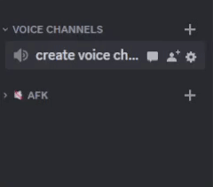
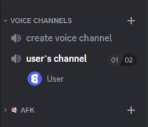

# Discord bot voice manager

Бот для управления голосовыми каналами на сервере





## Оглавление

- [О проекте](#about-project)
- [Технологии](#technologies)
- [Запуск](#setup)

## <a id="about-project">О проекте</a>

Данный discord бот предназначен для управления голосовыми каналами. Он поможет избавить сервер от большого количество
различных голосовых каналов и даст возможность пользователем настраивать каналы под себя.

Функционал:

- Создание голосовых каналов
- Автоматическое удаление пустых голосовых каналов
- Настройка различных параметров голосовых каналов

Все команды данного бота начинаются с ```/voice```

##  <a id="technologies">Технологии</a>

Бот написан на NET 7 с использованием библиотеке Discord.Net. Для хранения данных используется PostgreSQL. Для хранения
кэша используется Redis. Для удобства разработки и развёртывания на сервере применяется Docker.

##  <a id="setup">Запуск</a>
Для запуска бота необходима установить Docker. В файле docker-compose.yml нужно указать токен бота Discord__Token.

### Сборка:

```bash
docker compose build
```

### Запуск:

```bash
docker compose up
```
Другие параметры можно посмотреть в [docker-compose.yml](docker-compose.yml) и в [appsettings.json](./src/DiscordBot.VoiceManager.Api/appsettings.json)
